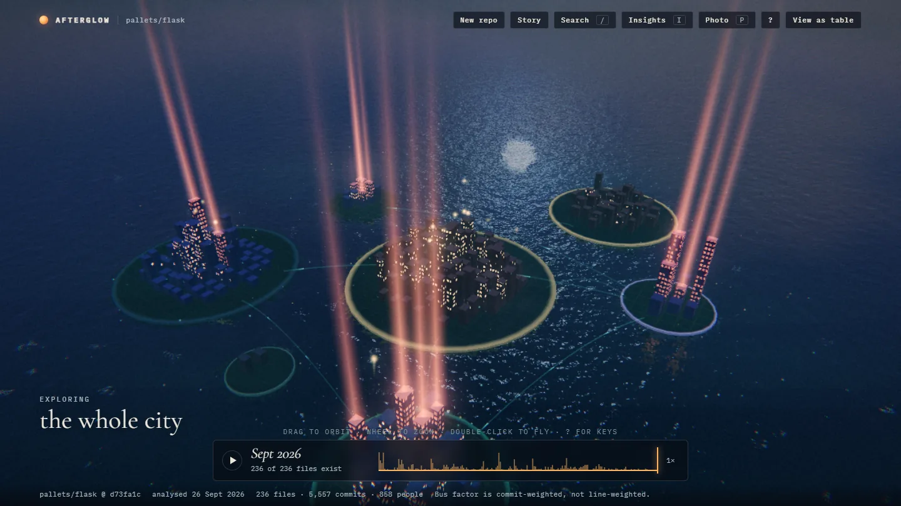
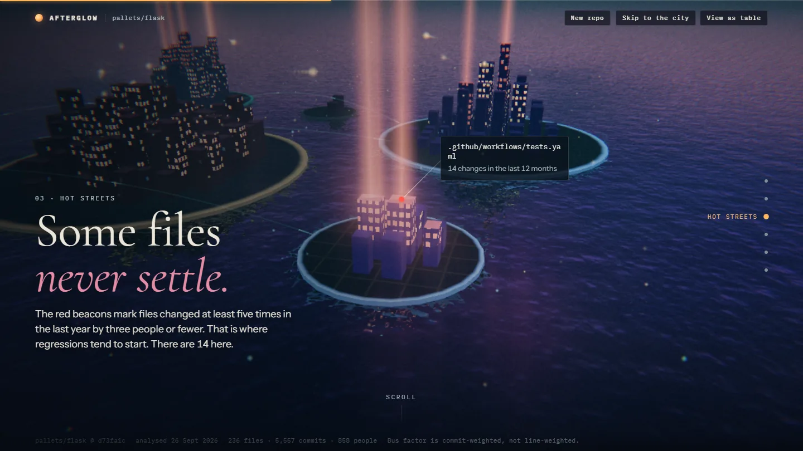

# Afterglow

Paste a public GitHub repository and its whole history grows into a night city you can scroll through and fly.



| What you see | What it means |
| --- | --- |
| Building | A file; height is its size in lines |
| Lit windows | Recent activity |
| Red beam | Hotspot: changed often in the last year by three people or fewer |
| Dark, fogged district | Untouched for over two years |
| Lanterns | Contributors (pseudonymous), roaming the files they work on |
| Arcs | Folders whose files change together |

A short scroll story walks through the findings, then the city opens for free exploration: search (`/`), an insights
panel (hotspots, bus factor, quiet areas, coupling), a timeline to replay history, compare two dates, share links,
photo mode, and a full keyboard map (`?`). Everything also works as a plain table, with or without WebGL.



## How it works

```
Browser --https--> Caddy (TLS, strict CSP, static files) --/api--> FastAPI --> Postgres (queue + results)
                                                                                 ^
                                            sandboxed worker (git) --egress proxy (github.com only)--+
```

- The worker makes a bare, blobless clone and reads `git log` metadata: paths, dates, change counts and line counts.
  It never checks out files, never reads email addresses, and shows contributors as `Contributor 1, 2, ...`.
- Results are cached per commit and validated against a strict schema on both server and client.
- Public repositories only. What is stored and for how long: [privacy note](frontend/privacy.html).

## Run it locally

Needs Docker and Node 24 (on Windows, run the commands in Git Bash).

```bash
scripts/dev-env.sh                  # writes deploy/.env with random secrets
(cd frontend && npm ci --ignore-scripts && npm run build)
docker compose -f deploy/compose.yaml --profile worker up -d --build --wait
```

Open https://localhost:8443 (a local certificate, so the browser warns once). Development and test commands are in
[`CLAUDE.md`](CLAUDE.md).

## Deploy

On any Linux server with Docker and a domain name: point DNS at the server, add five lines to `deploy/.env`, and
start the same stack; Caddy gets the HTTPS certificate on its own. Step by step: [`docs/DEPLOY.md`](docs/DEPLOY.md).

Release images are published to GHCR with build provenance; pin them by digest from the
[release notes](https://github.com/MaXiMo000/afterglow/releases) and check them with
`gh attestation verify oci://<image@digest> --repo MaXiMo000/afterglow`.

## Security and quality

Every pull request runs typed checks, unit and end-to-end tests (including accessibility, CSP and performance
budgets), CodeQL, Semgrep, Trivy, gitleaks and dependency audits. The threat model is in
[`docs/SECURITY.md`](docs/SECURITY.md); reproducible evidence (sandbox trace, ZAP, load tests) is in
[`docs/SECURITY-EVIDENCE.md`](docs/SECURITY-EVIDENCE.md). An independent review has not been done yet.
Please report vulnerabilities privately through GitHub's "Report a vulnerability".

| Doc | Contents |
| --- | --- |
| [`docs/DEPLOY.md`](docs/DEPLOY.md) | Running it on your own server, operations, troubleshooting |
| [`docs/PLAN.md`](docs/PLAN.md) | Product, architecture, decisions, API, performance budgets |
| [`docs/EXPERIENCE.md`](docs/EXPERIENCE.md) | Scroll, camera, input, motion and UI specification |
| [`docs/SECURITY.md`](docs/SECURITY.md) | Threats, controls and the launch checklist |
| [`docs/SECURITY-EVIDENCE.md`](docs/SECURITY-EVIDENCE.md) | How each security claim was verified |
| [`docs/PERF-LOG.md`](docs/PERF-LOG.md) | Measured performance |

## License

[MIT](LICENSE)
